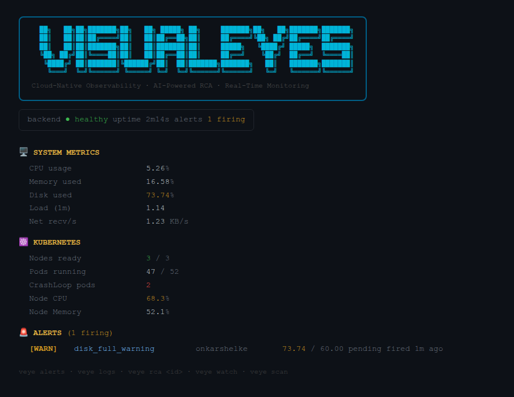
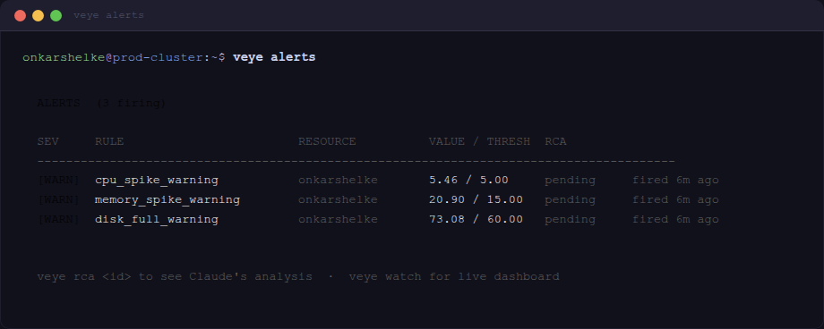
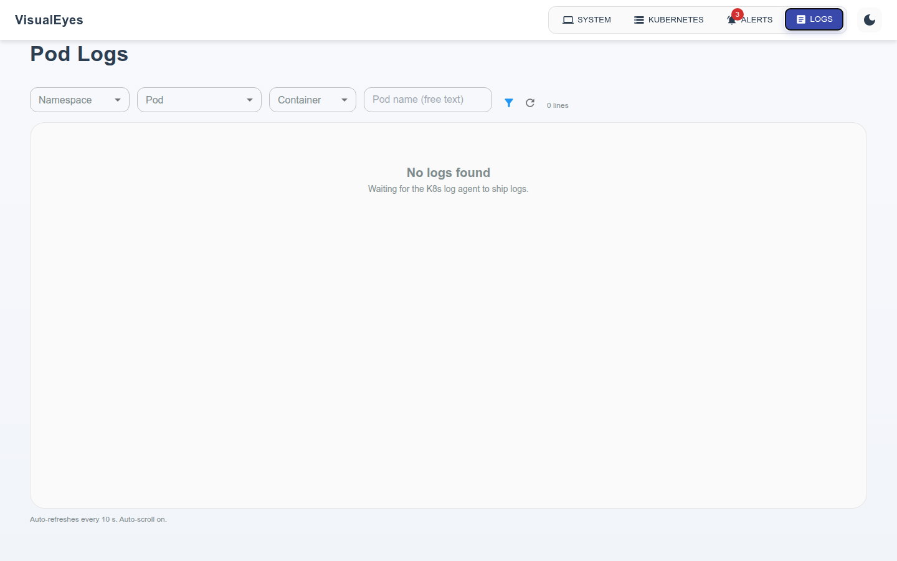
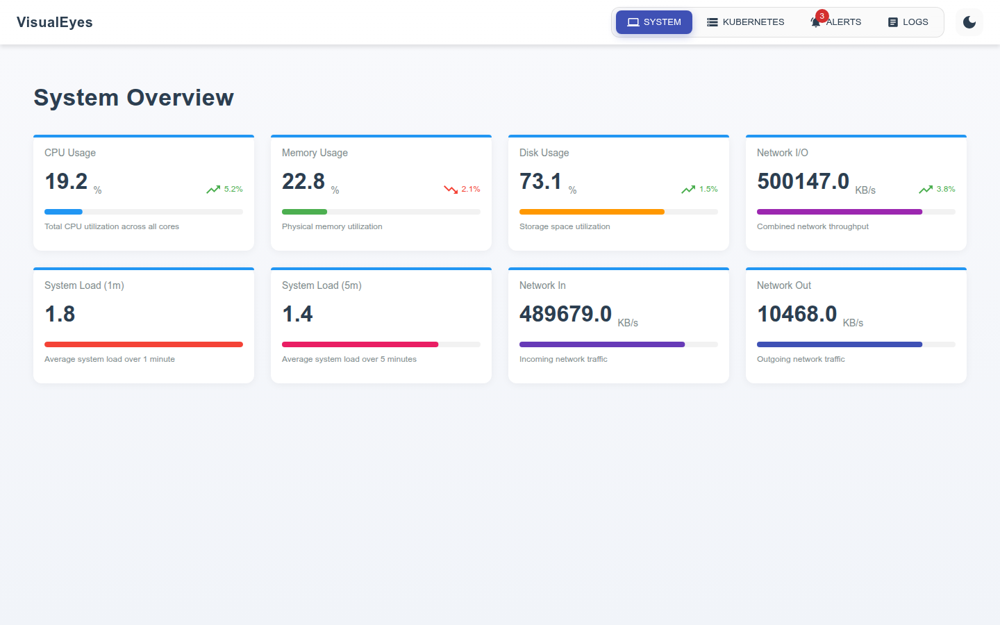

<div align="center">

```
 ██╗   ██╗██╗███████╗██╗   ██╗ █████╗ ██╗     ███████╗██╗   ██╗███████╗███████╗
 ██║   ██║██║██╔════╝██║   ██║██╔══██╗██║     ██╔════╝╚██╗ ██╔╝██╔════╝██╔════╝
 ██║   ██║██║███████╗██║   ██║███████║██║     █████╗   ╚████╔╝ █████╗  ███████╗
 ╚██╗ ██╔╝██║╚════██║██║   ██║██╔══██║██║     ██╔══╝    ╚██╔╝  ██╔══╝  ╚════██║
  ╚████╔╝ ██║███████║╚██████╔╝██║  ██║███████╗███████╗   ██║   ███████╗███████║
   ╚═══╝  ╚═╝╚══════╝ ╚═════╝ ╚═╝  ╚═╝╚══════╝╚══════╝   ╚═╝   ╚══════╝╚══════╝
```

**Cloud-Native Observability · AI-Powered RCA · Real-Time Monitoring**

[](https://github.com/onkar717/VisualEyes/actions/workflows/ci.yaml)
[](https://github.com/onkar717/VisualEyes/releases)
[](https://golang.org)
[](https://goreportcard.com/report/github.com/onkar717/visual-eyes)
[](LICENSE)
[](https://github.com/onkar717/VisualEyes/pulls)

### Open-source observability platform for Kubernetes with CrewAI-powered incident response

</div>

---

**VisualEyes** combines real-time metrics collection, a Bubbletea TUI, a **6-agent CrewAI RCA engine**, and a React web dashboard giving on-call engineers complete visibility from a single platform.

---

## Two Ways to Use VisualEyes

### 1. `veye` CLI (Go server-connected)
A Bubbletea-powered interactive TUI. Run `veye watch` for live metrics and alerts. Run `veye scan --ai` to trigger a 6-agent AI analysis and stream live stage progress to your terminal. Full incident history, MTTR, multi-cluster view.

### 2. `veye-ai` CLI (Python standalone)
Runs the CrewAI pipeline **directly** no Go server needed. One command:
```bash
pip install -e ai-sre/   # or: bash ai-sre/install.sh
veye-ai scan             # 6-agent RCA scan against your cluster
veye-ai watch            # continuous monitoring loop
veye-ai status           # instant cluster snapshot (no LLM)
```

### 3. Hub + Agents (Continuous Monitoring)
Deploy agents to your systems and Kubernetes clusters. Agents push metrics to a central Go backend with React dashboard, WebSocket streaming, PostgreSQL-backed incident history, and Slack/PagerDuty/webhook notifications.

---

## Features

- **System metrics** CPU, memory, disk, network, load average via `gopsutil`
- **Kubernetes metrics** pod-level and node-level stats via kubelet summary API
- **6-agent CrewAI RCA** Triage → Metrics → Logs → Infra → Runbook → Commander (Python, 24 tools)
- **Go RCA fallback** 6-stage sequential pipeline, no Python service required
- **Multi-LLM support** Groq, OpenAI, Anthropic, Mistral, Gemini, Ollama (LiteLLM)
- **SSE live streaming** `veye scan --ai` streams stage-by-stage RCA progress in real time
- **Alert engine** 16+ configurable rules, Z-score anomaly detection, dedup, auto-RCA trigger
- **WebSocket streaming** live metric push to React dashboard, no polling
- **Prometheus `/metrics`** plug into any Grafana/Prometheus stack
- **`veye` CLI** 12 commands: `status`, `alerts`, `logs`, `rca`, `scan --ai`, `watch`, `incidents`, `show`, `apply`, `report`, `clusters`, `logs`
- **PostgreSQL storage** persistent incident history, MTTR by severity, evidence trail
- **Safety-first remediation** typed `RemediationStep`, dry-run mode, kubectl allowlist (Go + Python re-validation)
- **Rich notifications** Slack Block Kit, PagerDuty, custom webhook, 30-min dedup window
- **Runbook library** 8 embedded YAML runbooks (`//go:embed`), external override via `VISUAL_EYES_RUNBOOK_DIR`
- **Multi-cluster registry** register multiple clusters, health scores, pod breakdown
- **`~/.veye/.env`** persist `VEYE_API_URL` and other settings without shell exports

---

## Architecture

```
┌─────────────────────────────────────────────────────────────────────┐
│                           VisualEyes                                │
│                                                                     │
│  ┌──────────────┐    ┌──────────────────────────────────────────┐  │
│  │ System Agent │    │          Kubernetes Agent                 │  │
│  │ (gopsutil)   │    │  (kubelet API · metrics + logs + events) │  │
│  └──────┬───────┘    └───────────────────┬──────────────────────┘  │
│         │  POST /api/system-metrics       │ POST /api/k8s-metrics   │
│         └──────────────────┬─────────────┘                         │
│                            ▼                                        │
│            ┌───────────────────────────┐                           │
│            │       Backend Server       │                           │
│            │  Go HTTP · port 8080       │                           │
│            │  Alert Engine (16+ rules)  │                           │
│            │  RCA Processor             │◄── fallback               │
│            │  SSE Progress Hub          │                           │
│            │  WebSocket Broadcaster     │                           │
│            │  Multi-Cluster Registry    │                           │
│            │  PostgreSQL / MemStore     │                           │
│            └──────────┬────────────────┘                           │
│                       │  HTTP /run-rca                              │
│                       ▼                                             │
│            ┌──────────────────────────┐                            │
│            │    AI-SRE Service         │                            │
│            │  Python · port 8001       │                            │
│            │  CrewAI · 6 agents        │                            │
│            │  24 tools (K8s/Prom/Loki) │                            │
│            │  LiteLLM (6 providers)    │                            │
│            │  Stage callbacks → SSE    │                            │
│            └──────────────────────────┘                            │
│                                                                     │
│        ┌──────────────┐       ┌───────────────────────┐            │
│        │  React UI     │       │  veye CLI (Go)         │           │
│        │  port 3000    │       │  12 commands + TUI     │           │
│        │  Glassmorphism│       │  veye scan --ai        │           │
│        └──────────────┘       └───────────────────────┘            │
│                                                                     │
│                        ┌──────────────────────┐                    │
│                        │  veye-ai CLI (Python) │                    │
│                        │  standalone · no Go   │                    │
│                        │  veye-ai scan/watch   │                    │
│                        └──────────────────────┘                    │
└─────────────────────────────────────────────────────────────────────┘
```

---

## Install

### `veye` CLI (Go binary no Go required)

```bash
curl -fsSL https://raw.githubusercontent.com/onkar717/VisualEyes/main/install.sh | bash
```

Or download directly from [Releases](https://github.com/onkar717/VisualEyes/releases).

### `veye-ai` CLI (Python standalone)

```bash
bash ai-sre/install.sh    # creates venv at ~/.visualeyes/venv, symlinks veye-ai
# then:
veye-ai status
veye-ai scan
```

Or install manually:
```bash
pip install -e ai-sre/
cp ai-sre/.env.example ~/.visualeyes/.env
# add your API key to ~/.visualeyes/.env
veye-ai scan
```

---

## Screenshots

### veye CLI Live System Status



### veye CLI Alert List



### Web Dashboard Dark Mode



### Web Dashboard System Overview



---

## Getting Started (Build from Source)

### Prerequisites

- Go 1.24+
- Node.js 18+
- Python 3.11+ (for AI-SRE service)
- Docker & Docker Compose
- PostgreSQL 14+ (or use Docker Compose no local install needed)
- `kubectl` + cluster (for Kubernetes mode)

### 1. Clone & Build

```bash
git clone https://github.com/onkar717/VisualEyes.git
cd VisualEyes

make deps            # Download Go dependencies
make build           # Build server, agents, and veye CLI → bin/
make install-ui      # Install frontend dependencies
make ai-sre-install  # Install Python AI-SRE dependencies
```

### 2. Configure

```bash
cp .env.example .env
# Required for AI RCA:
#   GROQ_API_KEY, OPENAI_API_KEY, ANTHROPIC_API_KEY, or MISTRAL_API_KEY
# Optional:
#   DATABASE_URL for PostgreSQL (falls back to in-memory)
#   SLACK_WEBHOOK_URL for notifications

cp ai-sre/.env.example ai-sre/.env
# Edit ai-sre/.env with your LLM provider + API key
```

### 3. Run Locally

```bash
./bin/visual-eyes-server          # Backend API on :8080
./bin/visual-eyes-agent           # System metrics push (separate terminal)
make run-ui                       # React UI on :5173

# Optional Python AI-SRE service (enables 6-agent CrewAI RCA)
make ai-sre-serve                 # Starts on :8001; Go server auto-detects it
```

### 4. Full Stack with Docker Compose

```bash
docker-compose up --build -d
# Backend   :8080
# UI         :3000
# AI-SRE    :8001   (CrewAI Python service)
# PostgreSQL :5432
# System agent (no port)
```

---

## veye CLI Commands

```bash
veye status                    # Cluster health: metrics, K8s, firing alerts, open incidents
veye scan                      # Proactive cluster health check
veye scan --ai                 # Trigger 6-agent AI RCA for all firing alerts (live stream)
veye scan --ai --apply         # Scan + interactively apply remediation
veye watch                     # Bubbletea TUI live dashboard
veye watch --apply             # Monitoring loop: prompt remediation on SEV1/2
veye alerts                    # List active alerts
veye incidents                 # Incident history with MTTR stats
veye incidents --severity SEV1 # Filter by severity
veye show 42                   # Show incident detail (numeric ID)
veye show INC-A3F2B1C4         # Show incident detail (incident code)
veye apply INC-A3F2B1C4        # Apply remediation for a specific incident
veye report                    # MTTR summary + incident table
veye report --incident-id 42   # Full incident report (stdout)
veye rca <alert-id>            # Show RCA result for an alert
veye logs                      # Recent pod logs
veye clusters                  # Multi-cluster registry: health scores + pod breakdown
```

### `veye` Configuration

```bash
# Persist API URL without shell exports:
mkdir -p ~/.veye
echo "VEYE_API_URL=http://my-server:8080" > ~/.veye/.env

# Or use the flag:
veye --api http://my-server:8080 status
```

---

## veye-ai CLI Commands (Standalone Python)

```bash
veye-ai scan                   # Full 6-agent AI-SRE scan (no Go server needed)
veye-ai scan --apply           # Scan + interactively apply remediation
veye-ai scan --namespace prod  # Target specific namespace
veye-ai watch                  # Continuous monitoring loop
veye-ai watch --apply          # Auto-remediate SEV1/2 findings
veye-ai watch --interval 120   # Custom scan interval (seconds)
veye-ai status                 # Instant cluster snapshot (no LLM)
veye-ai config                 # Show active LLM + config
veye-ai --model groq/llama-3.3-70b-versatile scan  # Override LLM model
```

---

## LLM Providers

Set in `.env` / `ai-sre/.env` / `docker-compose.yml`:

| Provider | Model example | Key |
|----------|---------------|-----|
| **Groq** (recommended fast + free) | `groq/llama-3.3-70b-versatile` | `GROQ_API_KEY` |
| OpenAI | `gpt-4o` | `OPENAI_API_KEY` |
| Anthropic | `claude-sonnet-4-6` | `ANTHROPIC_API_KEY` |
| Mistral | `mistral/mistral-large-latest` | `MISTRAL_API_KEY` |
| Gemini | `gemini/gemini-1.5-pro` | `GEMINI_API_KEY` |
| Ollama (local) | `ollama/llama3.2` | *(none)* |

---

## Kubernetes Deployment

```bash
kubectl apply -f deployments/kubernetes/rbac.yaml
kubectl apply -f deployments/kubernetes/config.yaml
kubectl apply -f deployments/kubernetes/agent.yaml

# Verify
kubectl get pods -n kube-system -l app=visual-eyes-k8s-agent
```

For minikube, kind, and production setup see [INSTALLATION.md](INSTALLATION.md).

---

## Alert Categories

VisualEyes detects and automatically triggers RCA for:

- **Pod Lifecycle** `CrashLoopBackOff`, `OOMKilled`, `ImagePullBackOff`, `Pending`, `CreateContainerConfigError`
- **Resource Pressure** CPU throttling, memory saturation, disk pressure, node not-ready
- **Kubernetes Health** pod restarts exceeding threshold, deployment replica mismatch, HPA at max replicas
- **Storage** unbound PVCs, volume mount failures
- **Custom Rules** define threshold-based alert rules in `configs/config.yaml`

---

## Development

```bash
# Go
make build          # Build all Go binaries (server, agents, veye)
make test           # Run Go tests with race detector
make fmt            # Format Go code
make lint           # Run golangci-lint
make cross          # Cross-compile → dist/ (10 platform targets)
make clean          # Remove build artifacts

# Python AI-SRE
make ai-sre-install  # Install Python runtime deps
make ai-sre-dev      # Install runtime + dev deps (ruff, mypy, pytest)
make ai-sre-lint     # ruff check + mypy
make ai-sre-serve    # Start FastAPI service hot-reload (:8001)
make ai-sre-scan     # Run standalone scan (no Go server)
make ai-sre-build    # Build Docker image

# Frontend
make install-ui      # npm ci
make build-ui        # npm run build (production)
make run-ui          # npm run dev
```

---

## Project Structure

```
VisualEyes/
├── system-agent/        # Host metrics agent: CPU, mem, disk, net, load
├── k8s-agent/           # Kubernetes agent: kubelet API, pod/node metrics, events, logs
├── server/
│   ├── alerts/          # Alert engine: rule eval, dedup, noise filter, Z-score anomaly
│   ├── api/             # HTTP handlers, routes, middleware (rate-limit, CORS, recovery)
│   ├── models/          # Incident, Alert, RemediationStep, Metric, PodLog models
│   ├── notifications/   # Slack Block Kit, PagerDuty, webhook, 30-min dedup notifier
│   ├── rca/             # AI RCA: 6-stage pipeline, CrewAI client, context builder,
│   │                    #         SSE progress hub, runbooks (//go:embed), executor
│   ├── storage/         # Interface, PostgreSQL, in-memory, event buffer, cluster registry
│   └── ws/              # WebSocket broadcaster
├── ai-sre/              # Python CrewAI service (port 8001)
│   ├── agents.py        # 6 specialist agents (Triage/Metrics/Logs/Infra/Runbook/Commander)
│   ├── pipeline.py      # Crew orchestration, stage callbacks → Go SSE hub
│   ├── cli.py           # veye-ai standalone CLI (scan/watch/status/config)
│   ├── config.py        # Multi-LLM config (Groq/OpenAI/Anthropic/Mistral/Gemini/Ollama)
│   ├── main.py          # FastAPI app (/run-rca, /health, /config)
│   ├── tools/
│   │   ├── k8s_tools.py      # 10 Kubernetes @tool functions
│   │   ├── metrics_tools.py  # 8 Prometheus @tool + Z-score anomaly detection
│   │   ├── log_tools.py      # 3 log analysis @tool (pod logs, patterns, Loki)
│   │   └── runbook_tools.py  # 3 runbook @tool + safe kubectl execution
│   ├── setup.py         # pip-installable package → veye-ai entry point
│   ├── install.sh       # One-command Python venv installer
│   └── requirements.txt
├── veye/
│   ├── cmd/             # 12 veye commands: status, alerts, scan --ai, watch, incidents,
│   │                    #                   show (INC-code), apply, report, clusters, rca, logs
│   └── internal/        # TUI model, API client, styles
├── ui/                  # React 19 + MUI 7 + Vite · glassmorphism dashboard
├── configs/             # Default YAML config + alert rules
├── deployments/
│   └── kubernetes/      # RBAC, ConfigMap, DaemonSet manifests
├── docs/
│   ├── runbooks/        # Human-readable incident runbooks (operator reference)
│   └── ARCHITECTURE.md
├── tests/
│   └── k8s-scenarios.yaml   # K8s test pods: crashloop, OOM, ImagePull, pending, etc.
├── install.sh           # One-line veye binary installer
├── docker-compose.yml   # Full stack: server + ui + ai-sre + system-agent + postgres
└── Makefile
```

---

## Roadmap

- [x] System metrics agent (CPU, mem, disk, net, load)
- [x] Kubernetes DaemonSet agent (kubelet API, pod/node metrics, events, logs)
- [x] Backend with alert engine, RCA processor, WebSocket, Prometheus
- [x] PostgreSQL persistent storage
- [x] React glassmorphism dashboard with dark mode, live updates, K8s health ring
- [x] AI-powered RCA 6-stage Go pipeline (Triage/Metrics/Logs/Infra/Runbook/Commander)
- [x] Python CrewAI AI-SRE service 6 specialist agents, 24 tools, 6 LLM providers
- [x] SSE live streaming `veye scan --ai` streams stage progress in real time
- [x] `veye` CLI 12 commands, Bubbletea TUI, incident code lookup (`INC-XXXX`)
- [x] `veye-ai` CLI standalone Python CLI, no Go server required
- [x] Multi-cluster registry health scores, pod breakdown, `veye clusters`
- [x] `~/.veye/.env` config file persist API URL without shell exports
- [x] GitHub Actions CI/CD Go, UI, Python lint, security, release, stale (6 workflows)
- [x] Cross-platform release 10 targets (server + veye, Linux/macOS/Windows, amd64/arm64)
- [x] Slack Block Kit + PagerDuty + webhook notifications, 30-min dedup
- [x] 8 embedded runbooks (`//go:embed`), external override via env var
- [x] MTTR tracking by severity, incident lifecycle (OPEN→INVESTIGATING→MITIGATED→RESOLVED)
- [x] Z-score anomaly detection (σ=2.5, 1-hour window, per-pod)
- [x] Safe remediation kubectl allowlist in Go + Python re-validation of LLM output
- [ ] Distributed tracing integration (OpenTelemetry)
- [ ] eBPF network flow visibility

---

## Contributing

Contributions are welcome. See [CONTRIBUTING.md](CONTRIBUTING.md) and [CODE_OF_CONDUCT.md](CODE_OF_CONDUCT.md).

```bash
git checkout -b feature/your-feature
make test && make lint
git commit -m "feat: describe your change"
git push origin feature/your-feature
# open a pull request
```

---

## License

MIT see [LICENSE](LICENSE).
